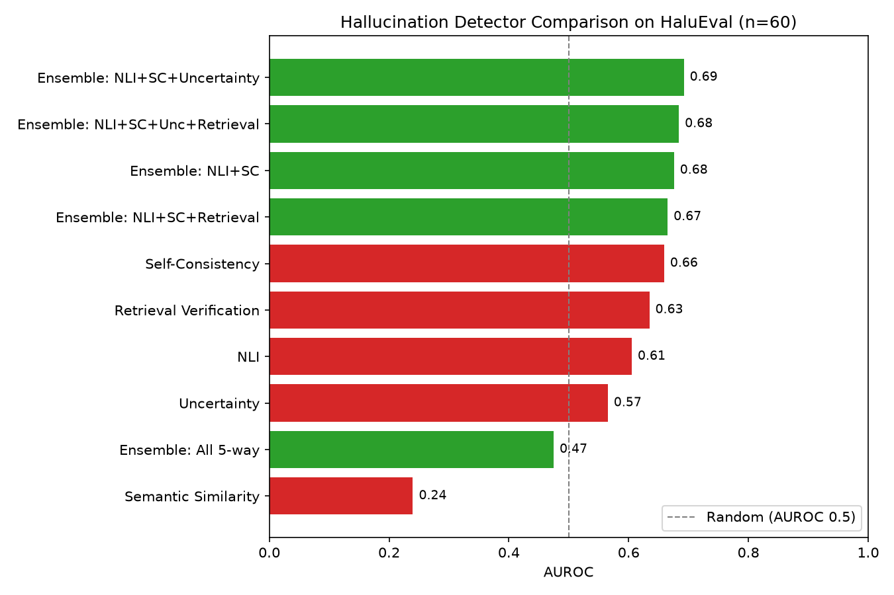

# Hallucination Detection in Large Language Models

## Overview
This project detects hallucinations in LLM outputs using five implemented detection methods -- NLI-based contradiction detection, self-consistency checking, semantic similarity, verbalized-confidence uncertainty, and retrieval-augmented verification -- combined into normalized ensembles, evaluated on FEVER and HaluEval.

## Implemented methods
- **NLI-based detection**: uses `facebook/bart-large-mnli` to check if a generated claim is entailed by, contradicted by, or neutral to its source context. Contradiction probability = hallucination risk.
- **Self-consistency detection**: generates multiple LLM responses to the same prompt (Groq `llama-3.1-8b-instant`) and measures embedding agreement across them. Low agreement = high hallucination risk.
- **Semantic similarity detection**: embeds the generated claim and source context, uses cosine distance as hallucination risk. Works well on FEVER; does not transfer to HaluEval-style QA grounding (see Results below).
- **Uncertainty detection**: prompts the LLM to self-rate its confidence (0-100) in its own answer, given the source context. Low confidence = high hallucination risk. Lightweight verbalized-confidence technique, no extra dependencies.
- **Retrieval-augmented verification**: narrows the source context down to its single most relevant sentence (TF-IDF cosine similarity to the claim), then runs NLI-based contradiction checking against that narrowed sentence instead of the full context. Designed to test whether narrowing context fixes the transfer problem seen with semantic similarity (see Results below).
- **Ensembles**: detector scores are min-max normalized, then averaged. Multiple detector combinations are compared (see Results below).

All 5 originally planned detection methods are now implemented.

## Results



### NLI detector on FEVER (n=200)
| Metric | Value |
|---|---|
| Accuracy | 0.79 |
| F1 | 0.52 |
| AUROC | 0.77 |

### NLI + Self-Consistency ensemble on HaluEval (n=60)
| Method | Accuracy | F1 | AUROC |
|---|---|---|---|
| NLI only | 0.68 | 0.30 | 0.59 |
| Self-consistency only | 0.70 | 0.18 | 0.72 |
| **Ensemble (normalized)** | **0.72** | 0.32 | **0.77** |

**Key finding**: the normalized ensemble achieves the best AUROC (0.77), outperforming either detector alone -- evidence the two methods capture complementary signal.

### Semantic similarity detector -- a third method, with a notable negative result

A third detector was added: cosine similarity between the embedded generated claim and its source context (low similarity -> high hallucination risk).

**On FEVER (n=200)**, this works reasonably well: AUROC 0.71, best F1 0.45 -- comparable to the other detectors.

**On HaluEval (n=60)**, it fails badly: AUROC as low as **0.12-0.24** across separate runs (consistently worse than random, i.e. inverted signal), and adding it to any ensemble *hurt* overall performance in every run tested.

**Why**: FEVER compares a claim sentence against a context sentence of similar scope, so similarity tracks agreement well. HaluEval compares a short QA answer (e.g. "Bram Stoker") against a long multi-sentence context passage -- a correct short answer is naturally *dissimilar* in embedding space to a long paragraph, while a rambling incorrect answer that echoes more of the context's wording can score artificially higher similarity. Raw embedding similarity, as implemented, doesn't transfer well to QA-answer grounding without adjustment.

**Conclusion used going forward**: semantic similarity is retained as a standalone, FEVER-validated detector, but excluded from HaluEval ensembles. This is reported as a deliberate, methodologically-grounded finding rather than a bug.

### Uncertainty detector -- a fourth method, added to the HaluEval ensemble

A fourth detector was added: verbalized confidence, where the LLM self-rates 0-100 confidence in its own answer given the source context.

**Key finding**: adding the uncertainty detector to NLI + self-consistency reliably improves ensemble AUROC over the 2-way baseline across multiple runs -- it contributes complementary signal, unlike semantic similarity.

### Retrieval-augmented verification -- a fifth method, completing the planned detector set

A fifth detector narrows the source context to its single most relevant sentence (via TF-IDF similarity to the claim) before running the existing NLI check against that narrowed sentence, rather than the full passage. The goal was to test whether this fixes the context-length mismatch that hurt semantic similarity.

**Results on HaluEval (n=60)**: standalone AUROC 0.63 -- a strong result, outperforming standalone NLI (0.61) and uncertainty (0.57) alone. However, adding it to the best existing ensemble (NLI + self-consistency + uncertainty) did not improve AUROC further; the 3-detector combination remained the best ensemble. Likely explanation: retrieval verification is built directly on top of the NLI detector, so its signal overlaps with NLI's rather than adding independent information -- unlike self-consistency and uncertainty, which come from structurally different signals (response agreement, self-reported confidence) and each added value.

**Key finding**: the best-performing ensemble across all detector combinations tested remains **NLI + Self-consistency + Uncertainty**. Adding either semantic similarity or retrieval verification to this ensemble reduces performance -- semantic similarity because its signal is inverted on HaluEval, retrieval verification because its signal is redundant with NLI's. The full 5-way ensemble consistently underperforms smaller, complementary combinations.

*Note: standalone detector AUROC values vary somewhat between runs (e.g. NLI has ranged 0.53-0.61, self-consistency 0.62-0.72), most likely due to non-determinism in live LLM calls (self-consistency sampling, uncertainty prompting) despite temperature 0. Relative rankings between detectors and ensembles have stayed consistent across runs even as absolute values shift.*

### Limitations
- Sample sizes (60-200) are small; treat metric differences as suggestive, not conclusive.
- HaluEval ground truth uses a token-overlap proxy against reference answers, not human labels.
- Semantic similarity does not transfer from FEVER-style claim verification to HaluEval-style QA grounding -- it is task-dependent, not a general-purpose signal in its current form.
- Retrieval verification's signal overlaps substantially with the NLI detector it's built on, limiting its marginal ensemble value despite being a strong standalone detector.
- Results show some run-to-run variance, likely from non-determinism in live LLM calls (self-consistency, uncertainty) despite temperature 0.
- All 5 originally planned detection methods are implemented; no further methods currently planned.

## Project structure
- `config/` -- configuration files
- `data/` -- FEVER and HaluEval benchmark data
- `src/detection/` -- nli_based_detection.py, self_consistency.py, semantic_similarity.py, uncertainity_methods.py, retrieval_verification.py (all implemented)
- `api/` -- API layer
- `notebooks/` -- exploratory notebooks
- `tests/` -- test suite
- `scripts/` -- evaluate_nli_on_fever.py, evaluate_ensemble_on_halueval.py, evaluate_semantic_similarity_on_fever.py, evaluate_ensemble_3way_halueval.py, evaluate_ensemble_4way_halueval.py, evaluate_ensemble_5way_halueval.py, generate_results_plots.py
- `results/logs/` -- nli_fever_eval.csv, ensemble_halueval_eval.csv, semantic_similarity_fever_eval.csv, ensemble_3way_halueval_eval.csv, ensemble_4way_halueval_eval.csv, ensemble_5way_halueval_eval.csv
- `results/plots/` -- halueval_auroc_comparison.png
- `docs/` -- documentation

## Installation
```bash
pip install -r requirements.txt
```

## Run evaluations
```bash
python scripts/evaluate_nli_on_fever.py
python scripts/evaluate_ensemble_on_halueval.py
python scripts/evaluate_ensemble_4way_halueval.py
python scripts/evaluate_ensemble_5way_halueval.py
python scripts/generate_results_plots.py
```

## Author
**Shobhakumari Singh**
